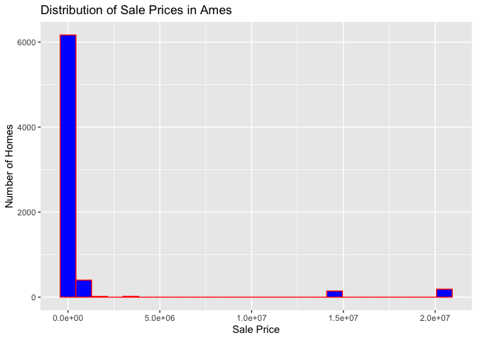

<!-- README.md is generated from README.Rmd. Please edit the README.Rmd file -->

# Lab report \#1

Follow the instructions posted at
<https://ds202-at-isu.github.io/labs.html> for the lab assignment. The
work is meant to be finished during the lab time, but you have time
until Monday evening to polish things.

Include your answers in this document (Rmd file). Make sure that it
knits properly (into the md file). Upload both the Rmd and the md file
to your repository.

All submissions to the github repo will be automatically uploaded for
grading once the due date is passed. Submit a link to your repository on
Canvas (only one submission per team) to signal to the instructors that
you are done with your submission.

# Step 1 result

``` r
ames |> slice_head(n = 6)
```

    ## # A tibble: 6 × 16
    ##   `Parcel ID` Address      Style Occupancy `Sale Date` `Sale Price` `Multi Sale`
    ##   <chr>       <chr>        <fct> <fct>     <date>             <dbl> <chr>       
    ## 1 0903202160  1024 RIDGEW… 1 1/… Single-F… 2022-08-12        181900 <NA>        
    ## 2 0907428215  4503 TWAIN … 1 St… Condomin… 2022-08-04        127100 <NA>        
    ## 3 0909428070  2030 MCCART… 1 St… Single-F… 2022-08-15             0 <NA>        
    ## 4 0923203160  3404 EMERAL… 1 St… Townhouse 2022-08-09        245000 <NA>        
    ## 5 0520440010  4507 EVERES… <NA>  <NA>      2022-08-03        449664 <NA>        
    ## 6 0907275030  4512 HEMING… 2 St… Single-F… 2022-08-16        368000 <NA>        
    ## # ℹ 9 more variables: YearBuilt <dbl>, Acres <dbl>,
    ## #   `TotalLivingArea (sf)` <dbl>, Bedrooms <dbl>,
    ## #   `FinishedBsmtArea (sf)` <dbl>, `LotArea(sf)` <dbl>, AC <chr>,
    ## #   FirePlace <chr>, Neighborhood <fct>

``` r
dim(ames)
```

    ## [1] 6935   16

``` r
glimpse(ames)
```

    ## Rows: 6,935
    ## Columns: 16
    ## $ `Parcel ID`             <chr> "0903202160", "0907428215", "0909428070", "092…
    ## $ Address                 <chr> "1024 RIDGEWOOD AVE, AMES", "4503 TWAIN CIR UN…
    ## $ Style                   <fct> 1 1/2 Story Frame, 1 Story Frame, 1 Story Fram…
    ## $ Occupancy               <fct> Single-Family / Owner Occupied, Condominium, S…
    ## $ `Sale Date`             <date> 2022-08-12, 2022-08-04, 2022-08-15, 2022-08-0…
    ## $ `Sale Price`            <dbl> 181900, 127100, 0, 245000, 449664, 368000, 0, …
    ## $ `Multi Sale`            <chr> NA, NA, NA, NA, NA, NA, NA, NA, NA, NA, NA, NA…
    ## $ YearBuilt               <dbl> 1940, 2006, 1951, 1997, NA, 1996, 1960, 2006, …
    ## $ Acres                   <dbl> 0.109, 0.027, 0.321, 0.103, 0.287, 0.494, 0.17…
    ## $ `TotalLivingArea (sf)`  <dbl> 1030, 771, 1456, 1289, NA, 2223, 1165, 658, 13…
    ## $ Bedrooms                <dbl> 2, 1, 3, 4, NA, 4, 5, 1, 3, 4, 4, 2, 2, 3, 2, …
    ## $ `FinishedBsmtArea (sf)` <dbl> NA, NA, 1261, 890, NA, NA, 906, NA, NA, 500, 5…
    ## $ `LotArea(sf)`           <dbl> 4740, 1181, 14000, 4500, 12493, 21533, 7500, 1…
    ## $ AC                      <chr> "Yes", "Yes", "Yes", "Yes", "No", "Yes", "Yes"…
    ## $ FirePlace               <chr> "Yes", "No", "No", "No", "No", "Yes", "Yes", "…
    ## $ Neighborhood            <fct> (28) Res: Brookside, (55) Res: Dakota Ridge, (…

Samara’s thoughts:

Wyatt’s thoughts: The data set contains 6935 rows and 16 columns, where
rows represent a residential property sale. Key variables include year
built, acres, neighborhood, and TotalLivingArea. The main variable is
Sale Price which represents the final sale price of the home. Depending
on the variables listed above cna chang the range of the variables.

(Name) thoughts:

(Name) thoughts:

(Combined) As a team, we found that …

# Step 2 result

Samara’s thoughts:

Wyatt’s thoughts: The main variable is sales price, which means that its
the price of each property sold in Ames. Its important because it shows
the values of homes and allows us to look at how the other variables
effect it.

(Name) thoughts:

(Name) thoughts: (Combined) As a team, we found that …

# Step 3 result

``` r
summary(ames$`Sale Price`)
```

    ##     Min.  1st Qu.   Median     Mean  3rd Qu.     Max. 
    ##        0        0   170900  1017479   280000 20500000

``` r
range(ames$`Sale Price`, na.rm = TRUE)
```

    ## [1]        0 20500000

``` r
library(ggplot2)

ggplot(ames, aes(x = `Sale Price`)) +
  geom_histogram(bins = 25, fill = "blue", color = "red") +
  labs(
    title = "Distribution of Sale Prices in Ames",
    x = "Sale Price",
    y = "Number of Homes"
  )
```

<!-- -->

Samara’s thoughts:

Wyatt’s thoughts: Houses range from 0 to 20500000 dollars with the
median being 170900. The distribution of sale prices is highly right
skewed. This means that most homes sell for moderate prices with a few
outliers of very high price. There are properties with a sale price of
0, which probably means that the data was incorrectly recorded.

(Name) thoughts:

(Name) thoughts:

(Combined) As a team, we found that …

# Step 4 result

``` r
summary(ames$`TotalLivingArea (sf)`)
```

    ##    Min. 1st Qu.  Median    Mean 3rd Qu.    Max.    NA's 
    ##       0    1095    1460    1507    1792    6007     447

``` r
range(ames$`TotalLivingArea (sf)`, na.rm = TRUE)
```

    ## [1]    0 6007

``` r
ggplot(ames, aes(x = `TotalLivingArea (sf)`)) +
  geom_histogram(bins = 25, fill = "blue", color = "red") +
  labs(
    title = "Distribution of Total Living Area",
    x = "Total Living Area",
    y = "Number of Homes"
  )
```

    ## Warning: Removed 447 rows containing non-finite outside the scale range
    ## (`stat_bin()`).

<!-- -->

Samara’s work:

Wyatt’s work: Total living Area measures the interior living space of
the home. The histogram shows that fewer home have large living space.
It is right skewed meaning that large homes are not common. The
relationship between them is positive as when one increases they both
increase. This is also seen in 3 with some of the outliers. However,
some smaller homes can sell for higher, meaning that there are other
factors as well.

(Name) work:

(Name) work:
