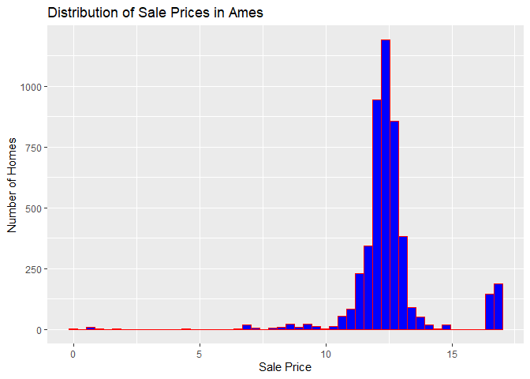
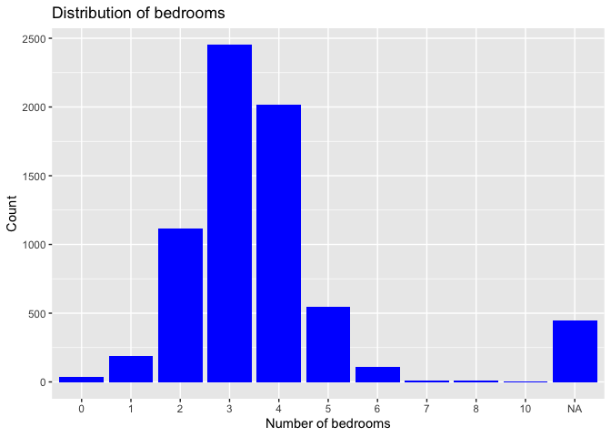
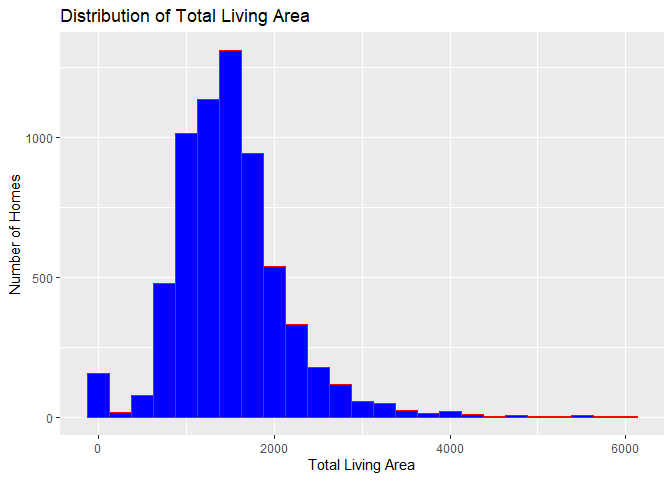
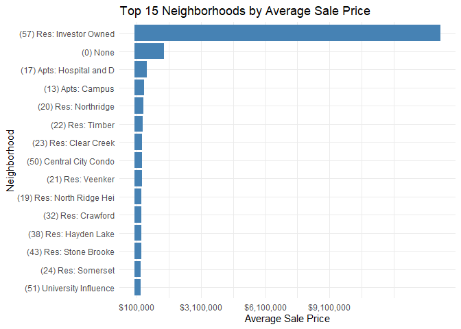

<!-- README.md is generated from README.Rmd. Please edit the README.Rmd file -->

# Lab 02 Report

Follow the instructions posted at
<https://ds202-at-isu.github.io/labs.html> for the lab assignment. The
work is meant to be finished during the lab time, but you have time
until Monday evening to polish things.

Include your answers in this document (Rmd file). Make sure that it
knits properly (into the md file). Upload both the Rmd and the md file
to your repository.

All submissions to the github repo will be automatically uploaded for
grading once the due date is passed. Submit a link to your repository on
Canvas (only one submission per team) to signal to the instructors that
you are done with your submission.

# Step 1 result

``` r
ames |> slice_head(n = 6)
```

    ## # A tibble: 6 × 16
    ##   `Parcel ID` Address      Style Occupancy `Sale Date` `Sale Price` `Multi Sale`
    ##   <chr>       <chr>        <fct> <fct>     <date>             <dbl> <chr>       
    ## 1 0903202160  1024 RIDGEW… 1 1/… Single-F… 2022-08-12        181900 <NA>        
    ## 2 0907428215  4503 TWAIN … 1 St… Condomin… 2022-08-04        127100 <NA>        
    ## 3 0909428070  2030 MCCART… 1 St… Single-F… 2022-08-15             0 <NA>        
    ## 4 0923203160  3404 EMERAL… 1 St… Townhouse 2022-08-09        245000 <NA>        
    ## 5 0520440010  4507 EVERES… <NA>  <NA>      2022-08-03        449664 <NA>        
    ## 6 0907275030  4512 HEMING… 2 St… Single-F… 2022-08-16        368000 <NA>        
    ## # ℹ 9 more variables: YearBuilt <dbl>, Acres <dbl>,
    ## #   `TotalLivingArea (sf)` <dbl>, Bedrooms <dbl>,
    ## #   `FinishedBsmtArea (sf)` <dbl>, `LotArea(sf)` <dbl>, AC <chr>,
    ## #   FirePlace <chr>, Neighborhood <fct>

``` r
dim(ames)
```

    ## [1] 6935   16

``` r
glimpse(ames)
```

    ## Rows: 6,935
    ## Columns: 16
    ## $ `Parcel ID`             <chr> "0903202160", "0907428215", "0909428070", "092…
    ## $ Address                 <chr> "1024 RIDGEWOOD AVE, AMES", "4503 TWAIN CIR UN…
    ## $ Style                   <fct> 1 1/2 Story Frame, 1 Story Frame, 1 Story Fram…
    ## $ Occupancy               <fct> Single-Family / Owner Occupied, Condominium, S…
    ## $ `Sale Date`             <date> 2022-08-12, 2022-08-04, 2022-08-15, 2022-08-0…
    ## $ `Sale Price`            <dbl> 181900, 127100, 0, 245000, 449664, 368000, 0, …
    ## $ `Multi Sale`            <chr> NA, NA, NA, NA, NA, NA, NA, NA, NA, NA, NA, NA…
    ## $ YearBuilt               <dbl> 1940, 2006, 1951, 1997, NA, 1996, 1960, 2006, …
    ## $ Acres                   <dbl> 0.109, 0.027, 0.321, 0.103, 0.287, 0.494, 0.17…
    ## $ `TotalLivingArea (sf)`  <dbl> 1030, 771, 1456, 1289, NA, 2223, 1165, 658, 13…
    ## $ Bedrooms                <dbl> 2, 1, 3, 4, NA, 4, 5, 1, 3, 4, 4, 2, 2, 3, 2, …
    ## $ `FinishedBsmtArea (sf)` <dbl> NA, NA, 1261, 890, NA, NA, 906, NA, NA, 500, 5…
    ## $ `LotArea(sf)`           <dbl> 4740, 1181, 14000, 4500, 12493, 21533, 7500, 1…
    ## $ AC                      <chr> "Yes", "Yes", "Yes", "Yes", "No", "Yes", "Yes"…
    ## $ FirePlace               <chr> "Yes", "No", "No", "No", "No", "Yes", "Yes", "…
    ## $ Neighborhood            <fct> (28) Res: Brookside, (55) Res: Dakota Ridge, (…

``` r
summary(ames)
```

    ##   Parcel ID           Address                        Style     
    ##  Length:6935        Length:6935        1 Story Frame    :3732  
    ##  Class :character   Class :character   2 Story Frame    :1456  
    ##  Mode  :character   Mode  :character   1 1/2 Story Frame: 711  
    ##                                        Split Level Frame: 215  
    ##                                        Split Foyer Frame: 156  
    ##                                        (Other)          : 218  
    ##                                        NA's             : 447  
    ##                           Occupancy      Sale Date            Sale Price      
    ##  Condominium                   : 711   Min.   :2017-07-03   Min.   :       0  
    ##  Single-Family / Owner Occupied:4711   1st Qu.:2019-03-27   1st Qu.:       0  
    ##  Townhouse                     : 745   Median :2020-09-22   Median :  170900  
    ##  Two-Family Conversion         : 139   Mean   :2020-06-14   Mean   : 1017479  
    ##  Two-Family Duplex             : 182   3rd Qu.:2021-10-14   3rd Qu.:  280000  
    ##  NA's                          : 447   Max.   :2022-08-31   Max.   :20500000  
    ##                                                                               
    ##   Multi Sale          YearBuilt        Acres         TotalLivingArea (sf)
    ##  Length:6935        Min.   :   0   Min.   : 0.0000   Min.   :   0        
    ##  Class :character   1st Qu.:1956   1st Qu.: 0.1502   1st Qu.:1095        
    ##  Mode  :character   Median :1978   Median : 0.2200   Median :1460        
    ##                     Mean   :1976   Mean   : 0.2631   Mean   :1507        
    ##                     3rd Qu.:2002   3rd Qu.: 0.2770   3rd Qu.:1792        
    ##                     Max.   :2022   Max.   :12.0120   Max.   :6007        
    ##                     NA's   :447    NA's   :89        NA's   :447         
    ##     Bedrooms      FinishedBsmtArea (sf)  LotArea(sf)          AC           
    ##  Min.   : 0.000   Min.   :  10.0        Min.   :     0   Length:6935       
    ##  1st Qu.: 3.000   1st Qu.: 474.0        1st Qu.:  6553   Class :character  
    ##  Median : 3.000   Median : 727.0        Median :  9575   Mode  :character  
    ##  Mean   : 3.299   Mean   : 776.7        Mean   : 11466                     
    ##  3rd Qu.: 4.000   3rd Qu.:1011.0        3rd Qu.: 12088                     
    ##  Max.   :10.000   Max.   :6496.0        Max.   :523228                     
    ##  NA's   :447      NA's   :2682          NA's   :89                         
    ##   FirePlace                            Neighborhood 
    ##  Length:6935        (27) Res: N Ames         : 854  
    ##  Class :character   (37) Res: College Creek  : 652  
    ##  Mode  :character   (57) Res: Investor Owned : 474  
    ##                     (29) Res: Old Town       : 469  
    ##                     (34) Res: Edwards        : 444  
    ##                     (19) Res: North Ridge Hei: 420  
    ##                     (Other)                  :3622

**Samara’s thoughts:** The variables included are ParcelID, Address,
Style, Occupancy, Sale Date, Sale Price, Multi Sale, YearBuilt, Acres,
TotalLivingArea(sf), Bedrooms, FinishedBsmtArea(sf), LotArea(sf), AC,
FirePlace, and Neighborhood. Here is a list of the types, meanings, and
data range for each of the variables: - ParcelID(String), just a
character with ID - Address(String), property address in Ames, IA -
Style (Factor variable), detailing the type of housing. Most popular
ones are “1 Story Frame”, “2 Story Frame”, and “1 1/2 Story Frame” -
Occupancy (Factory variable), type of housing. Most popular ones are
“Condominium”, “Single-Family”, and “Townhouse”. - Sale Date (Date),
date of sale, ranging from 2017-07-03 to 2022-08-31 - Sale Price
(Number), is the price of sale (in US dollar), ranging from 0 to
20,500,000 - Multi Sale (String), was this sale part of a package? -
YearBuild (Number), year in which the house was built, ranging from 0 to
2022 - Acres (Number), acres of the lot, ranging from 0 to 12.012 -
TotalLivingArea (Number), total living area in sf, ranging from 0 to
6007 - Bedrooms (Number), number of bedrooms, ranging from 0 to 10 -
FinishedBsmtArea(Number), total area of the finished basement in sf,
ranging from 10 to 6496 - LotArea (Number), total area of the lot in sf,
ranging from 0 to 523,228 - AC (String), logical value of if the
property has AC or not - FirePlace (String), logical balue of if the
property has a FirePlace or not - Neighborhood (Factor), factor variable
of a level that indicates the neighboorhood area in Ames. Popular ones
are “N Ames”, “College Creek”, and “Investor Owned.”

**Wyatt’s thoughts:** The data set contains 6935 rows and 16 columns,
where rows represent a residential property sale. Key variables include
year built, acres, neighborhood, and TotalLivingArea. The main variable
is Sale Price which represents the final sale price of the home.
Depending on the variables listed above cna chang the range of the
variables.

**Tanisha’s thoughts:** The dataset contains 6,935 rows and 16 columns,
where each row represents a residential property sale. Some main
variables include Year Built, Neighborhood, and Total Living Area, while
the main variable is Sale Price, which shows the final selling price of
the home its value can change based on other variables in the dataset.

**(Combined) As a team, we found that** the dataset provides detailed
information about residential property sales in Ames, Iowa. Each of the
6,935 rows represents a single property sale, while the 16 columns
describe different characteristics of the property such as its location,
size, structure, and sale details. Important variables include Sale
Price, which represents the final selling price of the property, along
with factors like YearBuilt, Neighborhood, TotalLivingArea, Acres, and
Bedrooms that may influence the price. The dataset also includes
categorical variables such as Style, Occupancy, and Neighborhood, as
well as logical indicators like AC and FirePlace. By examining these
variables together, we can better understand patterns in housing
characteristics and how different factors may affect property values in
Ames.

# Step 2 result

**Samara’s thoughts:** I do agree with the rest that sales price would
be the main variable. I think other variables of interest could be
sale-date, occupancy, bedrooms, totalLivingArea, and Neighboorhood. This
is because these values would be the most influential variables that
control sale Price, along with any other variables the others mentioned.

**Wyatt’s thoughts:** The main variable is sales price, which means that
its the price of each property sold in Ames. Its important because it
shows the values of homes and allows us to look at how the other
variables effect it.

**Tanisha’s thoughts:** Yes. The main variable of interest is Sale
Price, which represents the final price at which a home is sold. The
other variables, such as Year Built, Acres, Neighborhood, and Total
Living Area, may help explain or influence the sale price.

**(Combined) As a team, we found that** the main variable of interest in
the dataset is Sale Price, since it represents the final price at which
each property in Ames was sold. This variable is important because it
reflects the value of homes and allows us to analyze how different
property characteristics may influence that value. Other variables such
as Sale Date, Occupancy, Bedrooms, TotalLivingArea, YearBuilt, Acres,
and Neighborhood are also important because they can help explain
differences in sale prices. By examining how these variables relate to
Sale Price, we can better understand the factors that affect.

# Step 3 result

``` r
summary(ames$`Sale Price`)
```

    ##     Min.  1st Qu.   Median     Mean  3rd Qu.     Max. 
    ##        0        0   170900  1017479   280000 20500000

``` r
range(ames$`Sale Price`, na.rm = TRUE)
```

    ## [1]        0 20500000

``` r
library(ggplot2)

ggplot(ames, aes(x = `Sale Price`)) +
  geom_histogram(bins = 25, fill = "blue", color = "red") +
  labs(
    title = "Distribution of Sale Prices in Ames",
    x = "Sale Price",
    y = "Number of Homes"
  )
```

<!-- -->

``` r
# ggplot with the log of sale price
ggplot(ames, aes(x = log(`Sale Price`))) +
  geom_histogram(bins = 50, fill = "blue", color = "red") +
  labs(
    title = "Distribution of Sale Prices in Ames",
    x = "Sale Price",
    y = "Number of Homes"
  )
```

<!-- -->

**Samara’s thoughts:** The range of the variable “Sale Price” is between
0 to 20,500,000. There are a few outliers both on the high price and low
price end, but the majority of the sale prices are around the meadian at
170900. The super high cost properties do increase the mean to 1017479.

**Wyatt’s thoughts:** Houses range from 0 to 20500000 dollars with the
median being 170900. The distribution of sale prices is highly right
skewed. This means that most homes sell for moderate prices with a few
outliers of very high price. There are properties with a sale price of
0, which probably means that the data was incorrectly recorded.

**Tanisha’s thoughts:** The main variable is Sale Price. Home prices
range from \$0 to \$20,500,000, with a median price of \$170,900. The
histogram shows the data is right-skewed, meaning most homes sell for
moderate prices and only a few sell for very high prices. Although there
are some outliers that have a price of \$0 which I believe could be due
to missing data.

**(Combined) As a team, we found that** the Sale Price variable ranges
from \$0 to \$20,500,000, with a median value of about \$170,900. The
distribution of sale prices is right-skewed, meaning that most homes
sell for moderate prices while a small number of homes sell for
extremely high prices, creating high-value outliers that increase the
mean. We also noticed that some properties have a sale price of \$0,
which likely indicates missing, incorrect, or special-case data rather
than actual home sales. Overall, the data shows that most homes in Ames
sell near the median price, with only a few very expensive properties
affecting the overall distribution.

# Step 4 result

**Samara’s work:**

I chose the number of bedrooms as my variable. The range of this
variable is between 0 and 10, with the most common number of bedrooms at
3. There is also a fairly symmetric distribution around the mean at
about 3.3.

Summary, range and plot of bedrooms:

``` r
summary(ames$Bedrooms)
```

    ##    Min. 1st Qu.  Median    Mean 3rd Qu.    Max.    NA's 
    ##   0.000   3.000   3.000   3.299   4.000  10.000     447

``` r
range(ames$Bedrooms, na.rm = TRUE)
```

    ## [1]  0 10

``` r
ames |>
  ggplot(aes(x = factor(Bedrooms))) +
    geom_bar(fill='blue') +
      labs(title = "Distribution of bedrooms", x = "Number of bedrooms", y = "Count")
```

<!-- -->

Plot of bedrooms vs sale price:

``` r
ames |>
  ggplot(aes(x = factor(Bedrooms), y = log10(`Sale Price`))) +
    geom_boxplot(fill = 'blue') + labs(title = "Sale Price by Number of Bedrooms", x  = "Number of Bedrooms", y ="Log(Sale Price)")
```

<!-- -->

Now, overall, the relationship between the Sale Price and number of
bedrooms, is that the median of the Sale Price increases as the number
of bedrooms increase. Now, something interesting is that when Number of
Bedrooms = 1, there is a super large upper quartile, meaning that there
are numerous 1 bedrooms that were sold at higher prices, which follows
up on the oddity found.

------------------------------------------------------------------------

**Wyatt’s Plot:**

``` r
summary(ames$`TotalLivingArea (sf)`)
```

    ##    Min. 1st Qu.  Median    Mean 3rd Qu.    Max.    NA's 
    ##       0    1095    1460    1507    1792    6007     447

``` r
range(ames$`TotalLivingArea (sf)`, na.rm = TRUE)
```

    ## [1]    0 6007

``` r
ggplot(ames, aes(x = `TotalLivingArea (sf)`)) +
  geom_histogram(bins = 25, fill = "blue", color = "red") +
  labs(
    title = "Distribution of Total Living Area",
    x = "Total Living Area",
    y = "Number of Homes"
  )
```

<!-- -->

Wyatt’s work: Total living Area measures the interior living space of
the home. The histogram shows that fewer home have large living space.
It is right skewed meaning that large homes are not common. The
relationship between them is positive as when one increases they both
increase. This is also seen in 3 with some of the outliers. However,
some smaller homes can sell for higher, meaning that there are other
factors as well.

------------------------------------------------------------------------

**Tanisha’s Plot:**

``` r
ames %>%
  filter(`Sale Price` > 0) %>%
  group_by(Neighborhood) %>%
  summarize(avg_price = mean(`Sale Price`, na.rm = TRUE)) %>%
  arrange(desc(avg_price)) %>%
  slice_head(n = 15) %>%
  ggplot(aes(x = avg_price, y = reorder(Neighborhood, avg_price))) +
  geom_col(fill = "steelblue") +
  scale_x_continuous(
    labels = scales::dollar,
    breaks = seq(100000, 12000000, by = 3000000)
  ) +
  labs(
    title = "Top 15 Neighborhoods by Average Sale Price",
    x = "Average Sale Price",
    y = "Neighborhood"
  ) +
  theme_minimal()
```

<!-- -->

Tanisha’s work: I chose the variable Neighborhood to examine how
location relates to Sale Price. The bar chart shows the top 15
neighborhoods with the highest average sale prices. The results indicate
that home prices vary across neighborhoods, suggesting that location
influences property value. One neighborhood, Investor Owned, has a much
higher average price than the others, likely due to a few very
high-priced sales influencing the overall data.

------------------------------------------------------------------------
